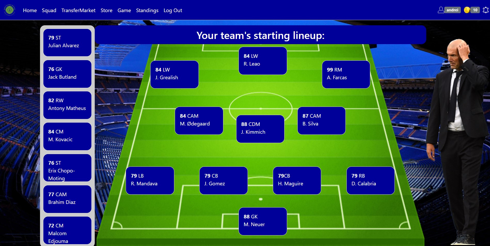
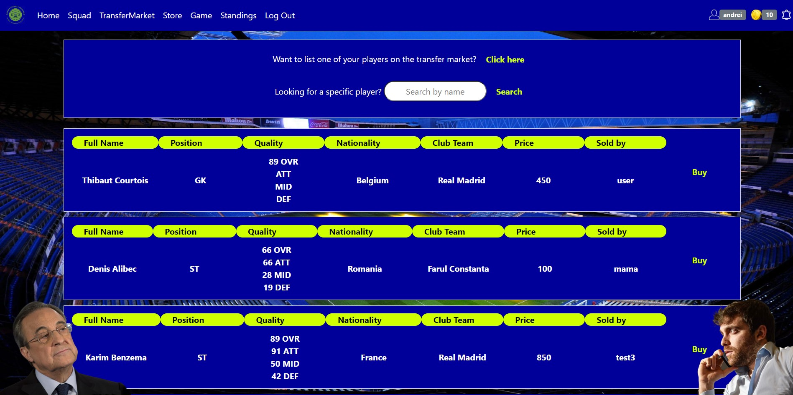
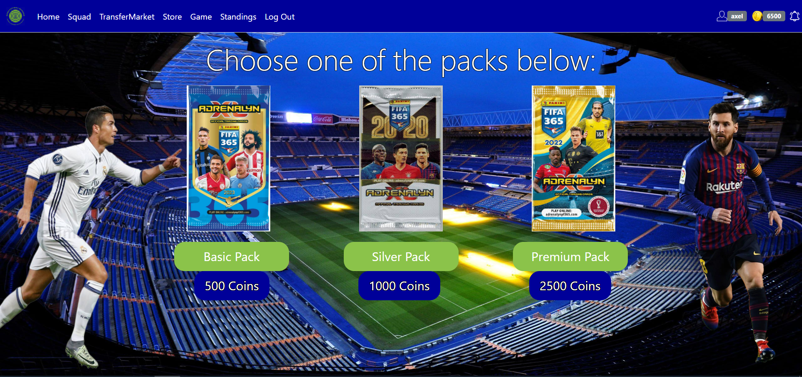

<!-- Improved compatibility of back to top link: See: https://github.com/othneildrew/Best-README-Template/pull/73 -->

<!--
*** Thanks for checking out the Best-README-Template. If you have a suggestion
*** that would make this better, please fork the repo and create a pull request
*** or simply open an issue with the tag "enhancement".
*** Don't forget to give the project a star!
*** Thanks again! Now go create something AMAZING! :D
-->

<!-- PROJECT SHIELDS -->
<!--
*** I'm using markdown "reference style" links for readability.
*** Reference links are enclosed in brackets [ ] instead of parentheses ( ).
*** See the bottom of this document for the declaration of the reference variables
*** for contributors-url, forks-url, etc. This is an optional, concise syntax you may use.
*** https://www.markdownguide.org/basic-syntax/#reference-style-links
-->
[![LinkedIn][linkedin-shield]][linkedin-url]

<!-- PROJECT LOGO -->
 

  

<h3 align="center">Sigma Football Manager</h3>

  

    Online football manager simulator with player-driven market
     
    <a href="./Sigma_Football_Manager_Documentation.pdf"><strong>Explore the docs »</strong></a>
     
     
  

<!-- TABLE OF CONTENTS -->

  
Table of Contents

  <ol>
    <li>
      <a href="#about-the-project">About The Project</a>
      <ul>
        <li><a href="#built-with">Built With</a></li>
      </ul>
    </li>
    <li>
      <a href="#getting-started">Getting Started</a>
      <ul>
        <li><a href="#prerequisites">Prerequisites</a></li>
        <li><a href="#installation">Installation</a></li>
      </ul>
    </li>
    <li><a href="#usage">Usage</a></li>
    <li><a href="#contact">Contact</a></li>
    <li><a href="#acknowledgments">Acknowledgments</a></li>
  </ol>

<!-- ABOUT THE PROJECT -->
## About The Project

[![Sigma Football Manager Screenshot][product-screenshot]](https://github.com/ciomin/sigma-football-manager)

Sigma Football Manager is an online football manager simulator where users can manage their own football teams, engage in player-driven markets, and make strategic decisions to influence their team's success. The project is designed to provide a realistic football management experience through a web-based platform.

(<a href="#readme-top">back to top</a>)

### Built With

* [![.NET][dotNET]][dotNET-url]
* [![HTML][HTML]][HTML-url]
* [![CSS][CSS]][CSS-url]
* [![JavaScript][JavaScript]][JavaScript-url]
* [![SQL][MSSQL]][MSSQL-url]

(<a href="#readme-top">back to top</a>)

<!-- USAGE EXAMPLES -->
## Usage

### Squad Manager
Customize lineup and positions via drag & drop

### Transfer Market
Trade players with other users

### Store
Purchase card packs of 3 different qualities for player cards using in-game currency

_For more examples, please refer to the [Documentation](./Sigma_Football_Manager_Documentation.pdf)_

(<a href="#readme-top">back to top</a>)

<!-- ACKNOWLEDGMENTS -->
## Acknowledgments

* [Radu Calomfirescu](https://github.com/StarSeeker17)
* [Andrei Fărcaș](https://github.com/andreiFarcas)
* Cristian Hădărău
* [Axel Morar](https://github.com/AxelBoii)

(<a href="#readme-top">back to top</a>)

<!-- MARKDOWN LINKS & IMAGES -->
<!-- https://www.markdownguide.org/basic-syntax/#reference-style-links -->
[linkedin-shield]: https://img.shields.io/badge/-LinkedIn-black.svg?style=for-the-badge&logo=linkedin&colorB=555
[linkedin-url]: https://linkedin.com/in/cosmin-iacobut
[product-screenshot]: images/home.jpg
[dotNET]: https://img.shields.io/badge/ASP.NET-2a166a?style=for-the-badge&logo=dotnet&logoColor=%23cbbff2
[dotNET-url]: https://dotnet.microsoft.com/en-us/
[HTML]: https://img.shields.io/badge/HTML-E34F26?style=for-the-badge&logo=html5&logoColor=FFFFFF
[HTML-url]: https://developer.mozilla.org/en-US/docs/Web/HTML
[CSS]: https://img.shields.io/badge/CSS-1572B6?style=for-the-badge&logo=css3
[CSS-url]: https://developer.mozilla.org/en-US/docs/Web/CSS
[JavaScript]: https://img.shields.io/badge/JavaScript-4d4609?style=for-the-badge&logo=javascript
[JavaScript-url]: https://developer.mozilla.org/en-US/docs/Web/JavaScript
[MSSQL]: https://img.shields.io/badge/SQL_Server-107391?style=for-the-badge&logo=microsoftsqlserver
[MSSQL-url]: https://www.microsoft.com/en-us/sql-server/

